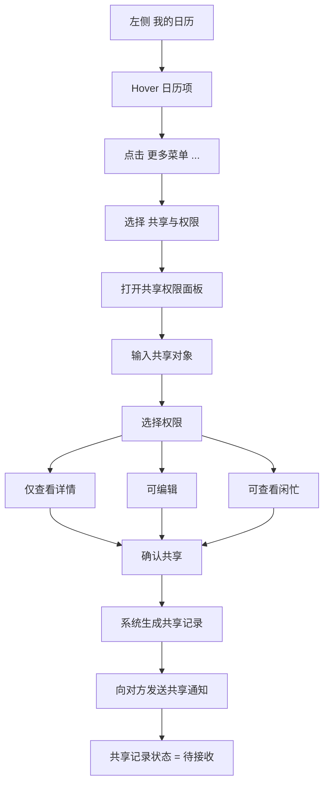
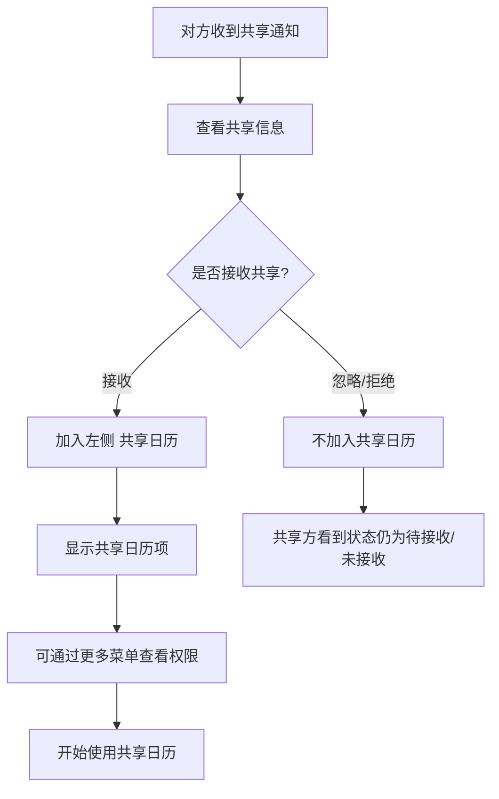
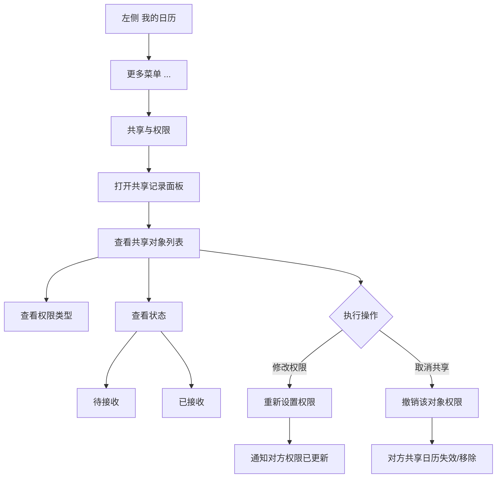
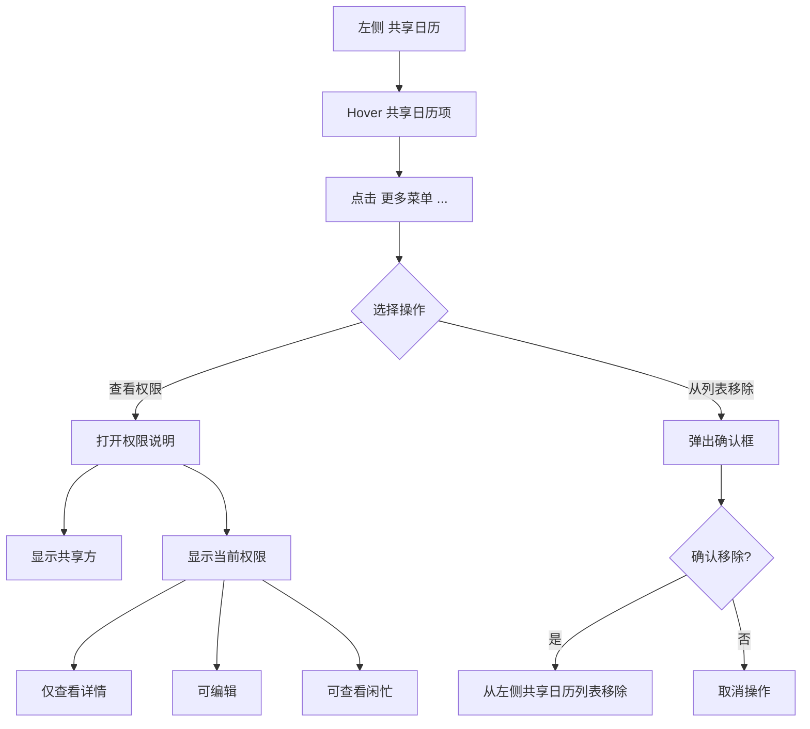
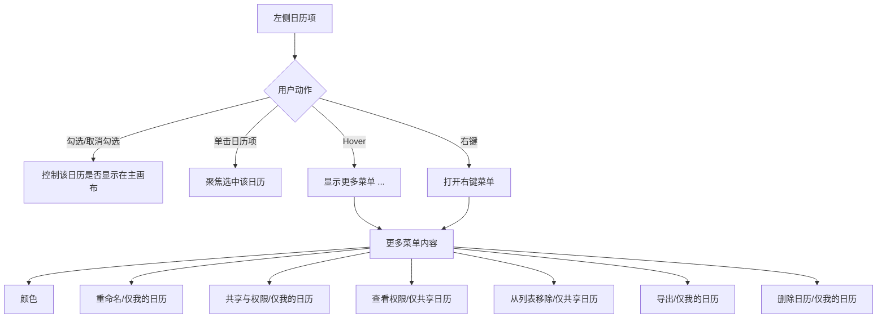

# Coremail 日历 — 共享权限方案（落地版）

> 版本：v1.0 | 日期：2026-04-23 | 状态：已落地

---

## 一、权限模型定义

### 1. 权限类型

| 权限类型 | 可见能力 | 不可做 |
|---------|---------|--------|
| **仅查看详情** | 查看日程标题、时间、地点、参与人、描述/备注 | 编辑/删除日程、修改参与人/提醒/分类/忙碌状态 |
| **可编辑** | 继承"仅查看详情"全部 + 新建/编辑/删除日程 + 修改提醒/分类/忙碌状态/事件内容 | 修改共享权限、再次分享、管理共享成员 |
| **可查看闲忙** | 仅查看时间占用情况、忙/闲时间块、时间分布 | 不显示详细标题/地点/描述、不可编辑/删除/查看详细信息 |

### 2. 分享对象状态

| 状态 | 说明 |
|-----|------|
| 待接收 | 共享已发起，对方尚未确认 |
| 已接收 | 对方已确认接收，正常使用中 |
| 已失效 / 已移除 | 共享被取消或对方主动移除 |

### 3. 左侧日历项分类

| 类型 | 说明 | 支持的操作菜单 |
|-----|------|--------------|
| **我的日历** | 我拥有并管理的日历 | 颜色 / 重命名 / 共享与权限 / 导出 / 删除日历 |
| **共享日历** | 别人共享给我的日历 | 颜色 / 查看权限 / 从列表移除 |

---

## 二、可视化流程图

### 流程图 1：分享日历给别人

### 流程图 2：对方接收共享

### 流程图 3：共享方管理共享记录

### 流程图 4：接收方查看权限 / 移除

### 流程图 5：左侧日历项交互总流程

---

## 三、左侧日历项详细交互规则

### 1. 日历项组成区域

- **显隐勾选区** — 控制主画布显示/隐藏
- **颜色标识** — 视觉区分不同日历
- **日历名称** — 显示日历名称
- **更多菜单入口（…）** — hover 时显示
- （桌面端支持右键菜单）

### 2. 单击规则

| 操作位置 | 行为 |
|---------|------|
| 勾选区 | 控制日历是否在主画布显示 |
| 日历项主体 | 聚焦/高亮该日历项，不直接进入管理页 |

### 3. Hover 规则

- 显示 `…` 更多菜单按钮
- 可选：颜色快捷编辑点（不建议过重）

### 4. 更多菜单内容

#### 我的日历项 `…` 菜单（顺序）

1. 🎨 **颜色**
2. ✏️ **重命名**
3. 👥 **共享与权限**
4. 📤 **导出**
5. 🗑️ **删除日历**

#### 共享日历项 `…` 菜单（顺序）

1. 🎨 **颜色**
2. 👁️ **查看权限**
3. ✖️ **从列表移除**

> 注意：共享日历不用"删除日历"，语义不对；用"从列表移除"更准确。

### 5. 右键菜单原则

**右键菜单 ≈ 更多菜单内容一致**

右键作为桌面端效率增强，不是唯一入口。

---

## 四、详细交互规则表

### A. 共享发起（我的日历）

| 项目 | 说明 |
|-----|------|
| **入口** | 我的日历 → hover → … → 共享与权限 |
| **面板内容** | 日历名称 + 标题「共享与权限」+ 输入成员/邮箱 + 权限下拉 + 确认按钮 + 已共享列表 |
| **已共享列表每行** | 成员名称/邮箱、权限类型、状态、修改权限/取消共享操作 |

**交互规则**：
1. 输入对象后必须选择权限才能确认
2. 确认后立即生成共享记录，默认"待接收"
3. 对方接收后状态更新为"已接收"
4. 支持行内修改权限
5. 支持取消共享

### B. 接收共享

| 项目 | 说明 |
|-----|------|
| **来源** | 站内通知 / 邮件通知 / 消息中心 |
| **通知内容** | 共享者、日历名称、权限类型、接收/忽略按钮 |
| **接收后行为** | 加入「共享日历」（默认可见）→ toast 提示 → 可通过 …→查看权限 查看 |

### C. 查看权限（共享日历）

| 项目 | 说明 |
|-----|------|
| **入口** | 共享日历 → hover → … → 查看权限 |
| **面板内容** | 共享方信息 + 当前权限类型 + 权限文案说明 |

**权限文案示例**：

| 权限类型 | 文案 |
|---------|------|
| 仅查看详情 | 可查看该日历中的详细事件信息，不可编辑 |
| 可编辑 | 可查看并编辑该日历中的事件，不可管理共享权限 |
| 可查看闲忙 | 仅可查看忙闲时间，不可查看详细事件内容 |

### D. 从列表移除（共享日历）

| 项目 | 说明 |
|-----|------|
| **入口** | 共享日历 → … → 从列表移除 |
| **确认框** | 标题：「从列表移除该共享日历？」说明：移除后仅从你的共享日历列表中隐藏，不会影响共享方设置 |
| **结果** | 从列表移除，不影响共享方的共享记录；后续可重新加入 |

> ⚠️ 业务语义建议明确区分：
> - **从列表移除** = 本地隐藏（不影响共享关系）
> - **退出共享** = 解除访问（需同步让共享失效）

### E. 修改权限（共享方）

| 项目 | 说明 |
|-----|------|
| **入口** | 我的日历 → … → 共享与权限 → 行内操作 |
| **交互** | 点击权限字段直接切换，立即生效 |
| **通知** | 可选：向对方发送权限变更通知 |

### F. 取消共享（共享方）

| 项目 | 说明 |
|-----|------|
| **入口** | 我的日历 → … → 共享与权限 → 行内操作 |
| **流程** | 点击取消共享 → 二次确认 → 权限失效 → 记录移除/标记已失效 → 对方日历同步消失或置灰 |

---

## 五、推荐菜单清单（最终版）

### 我的日历项

| 序号 | 菜单项 | 图标建议 |
|-----|--------|---------|
| 1 | 颜色 | Palette |
| 2 | 重命名 | Edit / Pencil |
| 3 | 共享与权限 | Users / Share2 |
| 4 | 导出 | FileText / Download |
| 5 | 删除日历 | Trash（红色警示） |

### 共享日历项

| 序号 | 菜单项 | 图标建议 |
|-----|--------|---------|
| 1 | 颜色 | Palette |
| 2 | 查看权限 | Eye / Shield |
| 3 | 从列表移除 | X（红色警示） |

---

## 六、文案规范

| 类别 | 文案 | 备注 |
|-----|------|------|
| **权限标签** | 仅查看详情 / 可编辑 / 可查看闲忙 | 统一短标签 |
| **状态标签** | 待接收 / 已接收 / 已失效 | 统一三态 |
| **我的日历** | 共享与权限 | 不要用"分享"、"管理"等混用 |
| **共享日历** | 查看权限 / 从列表移除 | 不要用"删除"、"退出"、"取消"混用 |

---

## 七、设计决策记录

| 决策项 | 结论 | 原因 |
|-------|------|------|
| 是否支持申请更高权限 | ❌ 不支持 | 简化模型，降低复杂度 |
| 单击日历项行为 | 聚焦选中，不弹面板 | 减少误触，提升操作确定性 |
| 共享日历是否可导出 | ❌ 默认不支持 | 除非业务明确要求 |
| 共享日历是否可本地重命名 | ❌ 默认不支持 | 除非业务明确要求 |
| 移除语义 | 本地隐藏 | 与"退出共享"区分开 |
